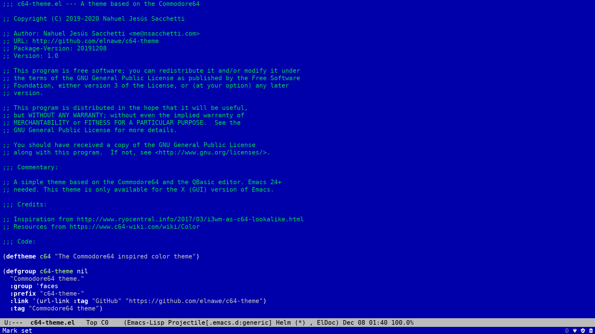
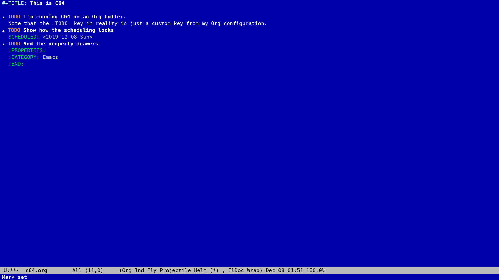
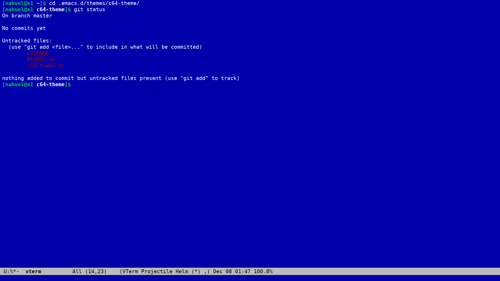

# Commodore64 Emacs Theme

This Emacs theme resembles the Commodore64 and the QBasic editor. It's just a fun and really simple theme that uses 16 colors to create a non-distracting environment.

## How I use it?

I do everything in Emacs. In fact, I run EXWM. But my work now consist in programming (not that much) and documentation. So this theme is focused on these two things.

- 4 colors elisp programming (counting comments),
- 3 to 4 colors Org Mode
- GNUS ready.

### External packages support

Like everyone in the Emacs world, I use quite a lot of packages. This theme supports:

- Emacs Lisp (and any other programming major-mode that inherit from the Emacs font-lock faces)
- Fancy Battery Mode
- Flyspell
- GNUS
- Helm
- Ledger-mode
- Org Bullets
- Org Mode

### Screenshots

#### Emacs Lisp



#### Org Mode



#### vterm



## Setup (and perks)

To setup this theme just clone this repository

```sh
git clone https://github.com/elnawe/c64-theme
```

Add the folder to the `custom-theme-load-path` variable.

```elisp
(add-to-list 'custom-theme-load-path "path/to/c64-theme")
```

And load the theme by running

```elisp
(load-theme 'c64 t)
```

### Some perks

The theme comes with a custom face for `org-bullets-mode`. Once the theme has been loaded, you can use the `org-bullets` face in the `org-bullets-face-name` variable to change their style.

```elisp
(setq org-bullets-face-name 'org-bullets)
```

## TODO

Here's a list of things that need to be fixed or added to the theme. This theme is currently work in progress but really usable. More features and changes are coming.

- Simplify the usage of colors to 4-5.
- Add support to VC, Magit and other known packages.

## Credits

Created by Nahuel Jesús Sacchetti <me@nsacchetti.com>. Learn more about me at: https://nsacchetti.com.

Inspiration from http://www.ryocentral.info/2017/03/i3wm-as-c64-lookalike.html. Resources from https://www.c64-wiki.com/wiki/Color
